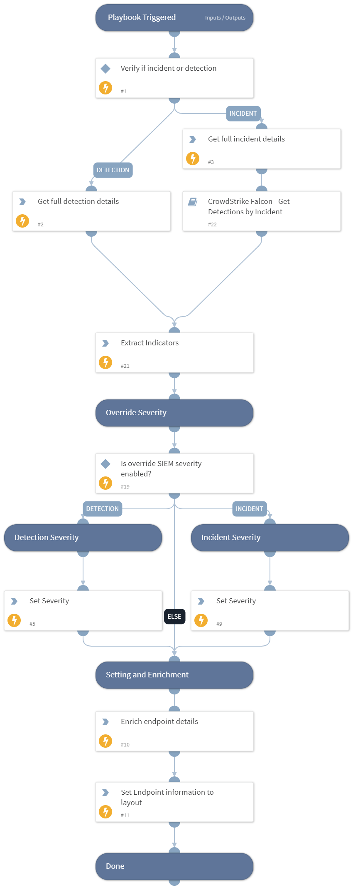

This playbook is part of the 'Malware Investigation And Response' flow. For more information, refer to https://xsoar.pan.dev/docs/reference/packs/malware-investigation-and-response.
This playbook handles incident ingestion from the SIEM. The user provides the field for the incident ID or detection ID as well as the field indicating whether the ingested item is an incident or detection. This playbook enables changing the severity scale in Cortex XSOAR as well as fetching CrowdStrike detections based on the CrowdStrike incident type.

## Dependencies
This playbook uses the following sub-playbooks, integrations, and scripts.

### Sub-playbooks
CrowdStrike Falcon - Get Detections by Incident

### Integrations
CrowdStrikeFalcon

### Scripts
This playbook does not use any scripts.

### Commands
* cs-falcon-list-incident-summaries
* extractIndicators
* cs-falcon-search-detection
* setIncident
* endpoint

## Playbook Inputs
---

| **Name** | **Description** | **Default Value** | **Required** |
| --- | --- | --- | --- |
| SIEMincidentFieldForType | The incident field that determines if this is a detection or an incident. | ${incident.externalcategoryname} | Optional |
| SIEMincidentFieldForID | The incident field that contains the detection ID or incident ID. | ${incident.externalsystemid} | Optional |
| ScaleToSetSeverity | The severity scale in the EDR. For example, CrowdStrike uses values from 0 to 100  so the scale can be divided into ranges such as 0-20,21-40,41-60,61-80,81-100 | 0-20,21-40,41-60,61-80,81-100 | Optional |
| SeverityValuesMapping | The mapping from the EDR severity scale to the Cortex XSOAR severity scale. For example:  0.5, 1, 2, 3,4 Possible values to use are 0,0.5, 1, 2, 3,4 which represent Unknown, Informational, Low, Medium, High, Critical. | 0.5, 1, 2, 3,4 | Optional |
| OverrideSIEMSeverity | Whether to set the severity according to the EDR severity scale and its mapping to Cortex XSOAR \(True\) or keep the original severity scale as mapped by the SIEM \(False\). | False | Optional |

## Playbook Outputs
---

| **Path** | **Description** | **Type** |
| --- | --- | --- |
| CrowdStrike.Detection.Behavior.FileName | The file name of the behavior. | string |
| CrowdStrike.Detection.Behavior.Scenario | The scenario name of the behavior. | string |
| CrowdStrike.Detection.Behavior.MD5 | The MD5 hash of the IOC of the behavior. | string |
| CrowdStrike.Detection.Behavior.SHA256 | The SHA256 hash of the IOC of the behavior. | string |
| CrowdStrike.Detection.Behavior.IOCType | The IOC type of the IOC. | string |
| CrowdStrike.Detection.Behavior.IOCValue | The value of the IOC. | string |
| CrowdStrike.Detection.Behavior.CommandLine | The command line executed in the behavior. | string |
| CrowdStrike.Detection.Behavior.UserName | The user name related to the behavior. | string |
| CrowdStrike.Detection.Behavior.SensorID | The sensor ID related to the behavior. | string |
| CrowdStrike.Detection.Behavior.ParentProcessID | The ID of the parent process. | string |
| CrowdStrike.Detection.Behavior.ProcessID | The process ID of the behavior. | string |
| CrowdStrike.Detection.Behavior.ID | The ID of the behavior. | string |
| CrowdStrike.Detection.System | The system name of the detection. | string |
| CrowdStrike.Detection.CustomerID | The ID of the customer \(CID\). | string |
| CrowdStrike.Detection.MachineDomain | The name of the domain of the detection machine. | string |
| CrowdStrike.Detection.ID | The detection ID. | string |
| CrowdStrike.Detection.ProcessStartTime | The start time of the process that generated the detection. | string |
| Endpoint | The details of the endpoint. | string |
| CrowdStrike.FoundDetections | Indicates whether detections were found. | string |

## Playbook Image
---

